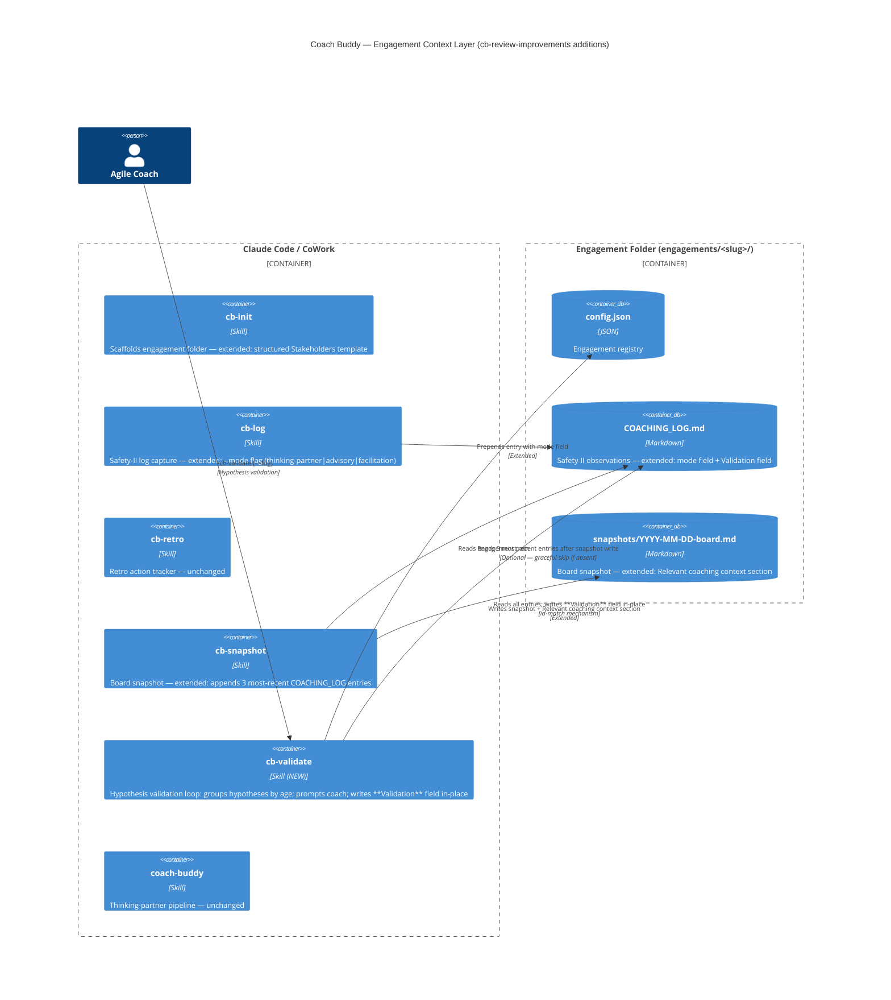

# Feature Delta — cb-review-improvements
Wave: DISCUSS + DESIGN + DELIVER | Date: 2026-05-15 | Density: lean

Source: AI reviewer analysis of coach-buddy SKILL.md and engagement layer. 12 gaps identified;
4 survive triage (2 full skills + 2 micro-improvements). 8 deferred or eliminated.

---

## Wave: DISCUSS / [REF] Persona ID

**Persona**: The Agile Coach (`docs/product/personas/agile-coach.yaml`)
Practitioner who coaches teams across multi-week engagements; relies on structured capture
to build a testable coaching arc rather than an impressionistic journal.

---

## Wave: DISCUSS / [REF] JTBD One-Liner

"When I've been coaching a team for weeks, I want to close the loop on my predictions and
arrive at each session with board state and coaching arc in one view, so I can learn from
my misses and coach from evidence rather than instinct."

---

## Wave: DISCUSS / [REF] Triage Decisions

| # | Gap | Verdict | Rationale |
|---|-----|---------|-----------|
| 2 | Hypothesis validation | **Build → Slice 01** | J7 records hypotheses; nothing closes the loop. Highest reviewer priority. |
| 6 | Snapshot + COACHING_LOG integration | **Build → Slice 02** | Pre-session prep requires two separate files today; merge into one view. |
| 1 | Advice Vector tracking | **Micro → Slice 03** | Mode field on cb-log entries, not a new skill. Low overhead. |
| 4 | Stakeholder power mapping | **Micro → Slice 03** | Enhanced CONTEXT.md template, not a new skill. |
| 3 | Multi-coach handoff | Defer | Assumes multi-coach engagements — unvalidated. |
| 5 | Stuck detection | Defer | Premature pattern detection across sessions. |
| 7 | Team feedback loop | **Eliminated** | Explicitly out of scope (`jobs.yaml` line 203): coach is sole user. |
| 8 | Calibration refresh | Not needed | Coach re-invokes /coach-buddy with fresh files — already solved. |
| 9 | Gherkin test visibility | Infrastructure | Meta-engineering concern; separate from coach-buddy features. |
| 10 | Mode confusion detection | Already solved | ADR-003/004/005 handle this in SKILL.md. |
| 11 | Continuity across interruptions | Doc improvement | COACHING_LOG already provides continuity; README gap, not a skill gap. |
| 12 | Cross-engagement pattern learning | Defer | Complex, privacy implications, no validated demand. |

---

## Wave: DISCUSS / [REF] Locked Decisions

**D1 — Gaps 2 and 6 build; all others deferred or eliminated.**
Rationale: Gaps 2 and 6 are the only items with clear JTBD traceability to validated jobs
and concrete user value. The rest are speculative, premature, or already solved.

**D2 — Gaps 1 and 4 ship as micro-improvements in Slice 03, not as new skills.**
Rationale: Both are template/field additions that do not warrant new skill files.
A new skill has ceremony (SKILL.md, testing, documentation); a field and a template do not.

**D3 — hypothesis-validation is a new job, not an extension of J7.**
Rationale: J7 ends at "record" — "so I can build a testable coaching arc". The testing
of hypotheses (did X happen?) is a distinct job step not covered by any existing job.

**D4 — No walking skeleton for this feature.**
Rationale: Brownfield project; all slices are incremental additions to existing skills.
Each slice ships end-to-end value without architectural risk.

---

## Wave: DISCUSS / [REF] User Stories

---

### Story S1 — Hypothesis Validation

**Job**: `hypothesis-validation` (new — see jobs.yaml update)

As an Agile Coach working with an ongoing engagement,
when I run `/cb-validate <team-slug>`,
I want to see my logged hypotheses grouped by age and validation status,
so I can close the loop on my predictions and build a coaching practice
that learns from misses, not just records them.

#### Elevator Pitch

Before: Hypotheses accumulate in COACHING_LOG.md — never revisited, confirmed, or disconfirmed.

After: run `/cb-validate <team-slug>` → sees grouped list: ">14 days unvalidated: [3 items]. Mark each as confirmed / disconfirmed / defer?"

Decision enabled: Coach decides which hypotheses to validate now, closing loops that otherwise stay open indefinitely.

#### Acceptance Criteria

- **AC1**: Given COACHING_LOG.md exists with ≥1 hypothesis field, when `/cb-validate <team-slug>` runs, then hypotheses are presented grouped by age: >14 days, 7–14 days, <7 days.
- **AC2**: Given the list is presented, when the coach marks a hypothesis as `confirmed`, `disconfirmed`, or `defer`, then COACHING_LOG.md is updated with `validation_status: <value>` and `validated_on: <date>`.
- **AC3**: Given no COACHING_LOG.md exists for the engagement, then the skill exits gracefully: "No coaching log found for `<team-slug>`."
- **AC4**: Given ≥2 log entries have `mode: advisory`, then /cb-validate surfaces a pattern note: "You've given direct advice in N sessions — is this intentional?"

---

### Story S2 — Pre-session Snapshot with Coaching Context

**Job**: `situated-coaching-across-sessions` (J6), `board-snapshot-without-context-switch` (J8)

As an Agile Coach preparing for a coaching conversation,
when I run `/cb-snapshot <team-slug>`,
I want the snapshot file to include the most relevant entries from my COACHING_LOG,
so I can reason from board state and coaching arc in a single view.

#### Elevator Pitch

Before: Snapshot shows board data. COACHING_LOG.md shows coaching arc. Two separate files to synthesise manually before every session.

After: run `/cb-snapshot <team-slug>` → snapshot file includes "Relevant coaching context:" section with up to 3 log entries pertinent to current WIP signals.

Decision enabled: Coach decides which dynamics to explore in the session based on both flow data and coaching arc — without opening a second file.

#### Acceptance Criteria

- **AC1**: Given COACHING_LOG.md exists for the engagement, when `/cb-snapshot` runs, then the snapshot file includes a `## Relevant coaching context` section with up to 3 log entries (most recent or most correlated to WIP age flags).
- **AC2**: Given COACHING_LOG.md does not exist, when `/cb-snapshot` runs, then the snapshot generates as before — no section added, no error.
- **AC3**: Given the snapshot includes coaching context, then each log entry shows: date, observation summary, and hypothesis — not the full entry.
- **AC4**: The two-sentence risk read printed in chat is unchanged.

---

### Story S3 — Advisory Mode Tracking (micro)

**Job**: `structured-observation-capture` (J7)

As an Agile Coach capturing a session observation,
when I run `/cb-log <team-slug>` with an optional `--mode` flag,
I want to tag the entry as `thinking-partner`, `advisory`, or `facilitation`,
so I can notice patterns in how I'm showing up across sessions.

#### Elevator Pitch

Before: All log entries look identical — no distinction between sessions where I coached, advised, or facilitated.

After: run `/cb-log <team-slug> --mode advisory` → entry tagged with `mode: advisory` in COACHING_LOG.md entry header.

Decision enabled: Coach decides whether advisory mode is a deliberate choice or a pattern to address.

#### Acceptance Criteria

- **AC1**: Given `/cb-log` is invoked with `--mode <value>` where value is `thinking-partner`, `advisory`, or `facilitation`, then the log entry header includes `mode: <value>`.
- **AC2**: Given `/cb-log` is invoked without `--mode`, then mode defaults to `thinking-partner` (no change to current entries).
- **AC3**: Given an unrecognised mode value, then the skill rejects with: "Mode must be one of: thinking-partner, advisory, facilitation."

---

### Story S4 — Stakeholder Power Mapping Template (micro)

**Job**: `situated-coaching-across-sessions` (J6)

As an Agile Coach initialising a new engagement,
when I run `/cb-init <team-slug>`,
I want the generated CONTEXT.md to include structured prompts for power dynamics and systemic forces,
so I capture who matters and what's shaping the team from day one rather than realising six weeks in that I've missed key forces.

#### Elevator Pitch

Before: CONTEXT.md Stakeholders section is a flat name list — no prompt for influence, inclusion, or "who am I not seeing?"

After: run `/cb-init <team-slug>` → CONTEXT.md Stakeholders section has: Role | Influence | Inclusion notes | External pressures, plus a "Who am I NOT seeing?" reflection prompt.

Decision enabled: Coach decides whether they have a complete picture of the system before the engagement deepens.

#### Acceptance Criteria

- **AC1**: Given `/cb-init` runs for a new engagement, when CONTEXT.md is generated, then the Stakeholders section includes four columns: Role, Influence level, Inclusion notes, External pressures.
- **AC2**: Given CONTEXT.md is generated, then it includes a "Who am I NOT seeing?" prompt below the stakeholders table.
- **AC3**: Given an existing engagement's CONTEXT.md (from a previous cb-init version), when `/cb-init` is run again, then it does not modify the existing file — template changes apply to new engagements only.

---

## Wave: DISCUSS / [REF] Story Map

```
Backbone (user activities)
─────────────────────────────────────────────────────────────────
Close the loop     │ Arrive with full context │ Track modality │ Start right
on hypotheses      │ for sessions             │ over time      │ from day one
─────────────────────────────────────────────────────────────────
Slice 01           │ Slice 02                 │ Slice 03       │ Slice 03
cb-validate        │ snapshot + log           │ cb-log mode    │ cb-init template
(S1)               │ integration (S2)         │ (S3)           │ (S4)
─────────────────────────────────────────────────────────────────
Walking skeleton: N/A (brownfield incremental; no architectural risk to resolve)
```

**Slice execution order** (learning leverage first):
1. **Slice 01** — cb-validate: highest learning leverage. Tests whether coaches will actually close loops when prompted. Highest-uncertainty assumption.
2. **Slice 02** — snapshot+log integration: lower uncertainty (the file-reading mechanism is already established); delivers immediate pre-session value.
3. **Slice 03** — micros: lowest uncertainty; additive fields with no behavioural risk.

---

## Wave: DISCUSS / [REF] Outcome KPIs

| Story | KPI | Target | Measurement |
|-------|-----|--------|-------------|
| S1 | % of logged hypotheses with `validation_status` within 30 days | ≥ 50% | Grep COACHING_LOG.md for `validation_status` |
| S2 | Snapshot files that include `## Relevant coaching context` | 100% when COACHING_LOG exists | File content check |
| S3 | Log entries with explicit `mode` field | ≥ 30% of entries across active engagements | Grep COACHING_LOG.md for `mode:` |
| S4 | Post-init "I missed key stakeholders" coaching log entries | 0 in first 30 days | Manual log review |

Proxy note: direct measurement requires inspection of real engagement files. These KPIs are
indicative — the true adoption signal is whether coaches reach for these skills without prompting.

---

## Wave: DISCUSS / [REF] Definition of Done

- [ ] Each story has: user + action + value statement
- [ ] Every story has a complete Elevator Pitch (Before / After / Decision enabled)
- [ ] All ACs are testable without ambiguity
- [ ] Every story traces to at least one job in `docs/product/jobs.yaml`
- [ ] Slice briefs exist for all 3 slices
- [ ] DoR validated (see below)
- [ ] `docs/product/jobs.yaml` updated with `hypothesis-validation` job
- [ ] Outcome KPIs defined with measurement method
- [ ] DESIGN wave can consume this delta without requiring expansions

---

## Wave: DISCUSS / [REF] DoR Validation

| Item | S1 | S2 | S3 | S4 |
|------|----|----|----|----|
| User + action + value clear | ✓ | ✓ | ✓ | ✓ |
| ACs testable without ambiguity | ✓ | ✓ | ✓ | ✓ |
| Job traceability | ✓ new job | ✓ J6+J8 | ✓ J7 | ✓ J6 |
| Elevator Pitch complete | ✓ | ✓ | ✓ | ✓ |
| Thin and shippable (≤1 day) | ✓ | ✓ | ✓ (with S3) | ✓ (with S3) |
| Dependencies identified | ✓ | ✓ | ✓ | ✓ |
| Out of scope defined (in slice brief) | ✓ | ✓ | ✓ | ✓ |
| Outcome KPIs defined | ✓ | ✓ | ✓ | ✓ |
| Walking skeleton N/A declared | ✓ | ✓ | ✓ | ✓ |

DoR: **PASSED** — all 9 items satisfied across all 4 stories.

---

## Wave: DISCUSS / [REF] Out of Scope

- Multi-coach handoff (`/cb-handoff`) — deferred
- Stuck/pattern detection (`/cb-stuck`) — deferred
- Team feedback loop — **eliminated** (coach is sole user, `jobs.yaml` line 203)
- Calibration refresh (`/cb-recalibrate`) — not needed
- Cross-engagement learning — deferred
- Modifying existing COACHING_LOG.md entries in ways that change their Safety-II structure
- Any server-side storage or sync — all artifacts are local files

---

## Wave: DISCUSS / [REF] WS Strategy

**Strategy B** — brownfield; no walking skeleton.
Each slice is an incremental addition to an existing skill or template.
Architectural risk is zero: all slices read/write existing COACHING_LOG.md format.

---

## Wave: DISCUSS / [REF] Driving Ports

- CLI: `/cb-validate <team-slug>` (new skill)
- CLI: `/cb-snapshot <team-slug>` (existing skill, extended)
- CLI: `/cb-log <team-slug> [--mode <value>]` (existing skill, extended)
- CLI: `/cb-init <team-slug>` (existing skill, template change only)

---

## Wave: DISCUSS / [REF] Pre-requisites

- Engagement folder must exist (`engagements/<team-slug>/`)
- COACHING_LOG.md must exist for S1 and S2 (graceful fallback if not)
- `hypothesis-validation` job added to `docs/product/jobs.yaml` before DESIGN

---

## Wave: DISCUSS / [REF] Wave Decisions Summary

```markdown
# DISCUSS Decisions — cb-review-improvements

## Key Decisions
- [D1] Build Gaps 2 and 6 as full skills; Gaps 1 and 4 as micros
- [D2] Gaps 1 and 4 are field/template additions, not new skill files
- [D3] hypothesis-validation is a new job in jobs.yaml
- [D4] No walking skeleton — brownfield incremental feature

## Requirements Summary
- Primary jobs: hypothesis-validation (new), J6, J7, J8
- Slice scope: cb-validate (new), cb-snapshot (extended), cb-log (extended), cb-init (template)
- Feature type: cross-cutting

## Constraints Established
- All artifacts are local files — no server-side storage
- Coach is sole user — team feedback is out of scope
- COACHING_LOG.md Safety-II structure is preserved; no destructive edits

## Upstream Changes
- None — no DISCOVER wave run; triage grounded in existing SSOT
```

---

## Wave: DESIGN / [REF] DDD List

| ID | Decision | Verdict |
|----|----------|---------|
| DDD-1 | cb-validate reads and mutates COACHING_LOG.md in-place | Accepted — in-place append of `**Validation**` field; same mechanism as cb-log `--update`; see ADR-011 |
| DDD-2 | cb-snapshot selects 3 most recent log entries by date (v1) | Accepted — simplest correct behaviour; keyword-to-WIP correlation deferred to v2 |
| DDD-3 | `mode:` field added to cb-log entry frontmatter | Accepted — additive; default `thinking-partner`; no migration needed for existing entries |
| DDD-4 | Stakeholders section in CONTEXT.md template is a structured table | Accepted — four columns; "Who am I NOT seeing?" prompt; new engagements only |
| DDD-5 | No new ADR for cb-snapshot or cb-log extensions | Accepted — both are additive to established ADR-010 pattern; no new architectural decision |
| DDD-6 | cb-validate blocks on guard if `**Validation**` already present | Accepted — prevents duplicate validation fields; prompts "Already validated as X. Update?" |

---

## Wave: DESIGN / [REF] Component Decomposition

| Component | Location | Change Type | Responsibility |
|-----------|----------|-------------|----------------|
| `cb-validate` | `skills/cb-validate/SKILL.md` | **CREATE NEW** | Read COACHING_LOG.md; group hypotheses by age; interactive validation loop; write `**Validation**` field in-place |
| `cb-snapshot` | `skills/cb-snapshot/SKILL.md` | **EXTEND** | Add COACHING_LOG.md read after snapshot write; append `## Relevant coaching context` section (3 most recent entries) |
| `cb-log` | `skills/cb-log/SKILL.md` | **EXTEND** | Accept `--mode` flag; validate enum; write `mode:` field to entry frontmatter; default `thinking-partner` |
| `cb-init` | `skills/cb-init/SKILL.md` | **EXTEND** | Replace Stakeholders comment in CONTEXT.md template with structured 4-column table + "Who am I NOT seeing?" prompt |
| `COACHING_LOG.md` (format) | `skills/cb-init/SKILL.md` (template) | **EXTEND** | Add `mode:` field to entry format template; shown in cb-init's COACHING_LOG.md template and cb-log's entry format |

---

## Wave: DESIGN / [REF] Driving Ports

| Port | Command | Skill |
|------|---------|-------|
| CLI | `/cb-validate [--slug <team-slug>]` | cb-validate (new) |
| CLI | `/cb-snapshot [--slug <team-slug>]` | cb-snapshot (extended — no new port, existing port extended) |
| CLI | `/cb-log <obs> [--mode <value>] [--slug <team-slug>]` | cb-log (extended — existing port, new optional flag) |
| CLI | `/cb-init [--force]` | cb-init (extended — existing port, template change only) |

---

## Wave: DESIGN / [REF] Driven Ports and Adapters

| Port | Adapter | Read/Write | Notes |
|------|---------|------------|-------|
| Engagement config | `config.json` | Read | All skills; slug resolution. Established by ADR-010. |
| Coaching log | `engagements/<slug>/COACHING_LOG.md` | Read + Write | cb-validate (read all entries; write validation field). cb-snapshot (read top 3). cb-log (write new entries; extends Mode 2 update). |
| Snapshot file | `engagements/<slug>/snapshots/<date>-board.md` | Write | cb-snapshot; extended to include coaching context section |
| CONTEXT.md template | Generated by cb-init | Write (once) | Template-only change; no runtime read dependency |

---

## Wave: DESIGN / [REF] Reuse Analysis

| Existing Component | File | Overlap | Decision | Justification |
|---|---|---|---|---|
| `cb-log` | `skills/cb-log/SKILL.md` | COACHING_LOG.md read/write; id-based in-place update (Mode 2) | EXTEND | cb-validate reuses identical id-match mechanism; `--mode` flag is additive |
| `cb-snapshot` | `skills/cb-snapshot/SKILL.md` | config.json read; engagement path resolution | EXTEND | COACHING_LOG read + section append after existing output logic (~20 lines) |
| `cb-init` | `skills/cb-init/SKILL.md` | CONTEXT.md template generation | EXTEND | Stakeholders section template swap only — no structural change |
| `cb-validate` | — | — | CREATE NEW | No existing skill reads hypotheses or drives interactive validation loop. cb-log `--update` is closest but serves a different responsibility: updating a known field on a known id, not scanning all entries, grouping by age, and driving a multi-entry dialogue |

---

## Wave: DESIGN / [REF] Entry Format Update

The COACHING_LOG.md entry format gains a `mode:` field (additive, optional):

```markdown
---
id: {YYYY-MM-DD}-{NNN}
date: {YYYY-MM-DD}
mode: thinking-partner

**Observed**: {observed}
**Context**: {context}
**Pattern/Signal**: {pattern}
**Hypothesis**: If [X continues/changes] then [Y will happen]
**Intervention**: {intervention}
**Follow-up**: {follow_up}
**Validation**: {status} ({date})    ← added by cb-validate only; absent until validated

---
```

Rules:
- `mode:` is written by cb-log at entry creation; defaults to `thinking-partner`
- `**Validation**` is written by cb-validate; absent on new entries; added after interactive confirmation
- cb-validate guards against duplicate validation: if `**Validation**` already present, prompt before overwriting
- No migration for existing entries without `mode:` — field is optional; cb-validate and cb-snapshot skip `mode:` parsing gracefully

---

## Wave: DESIGN / [REF] Technology Choices

| Layer | Choice | Rationale |
|-------|--------|-----------|
| Runtime | Claude Code / CoWork | Established by ADR-010; skills are markdown instruction sets |
| Persistence | Markdown files on filesystem | Established by ADR-010; zero dependencies, human-readable, version-controllable |
| Entry addressing | `id:` field (`YYYY-MM-DD-NNN`) | Established by cb-log; reused by cb-validate for in-place update |
| Configuration | `config.json` per engagement | Established by ADR-010; read by all cb- skills |

No new technology introduced. All choices extend the established ADR-010 pattern.

---

## Wave: DESIGN / [REF] C4 Update — Engagement Context Layer



---

## Wave: DESIGN / [REF] Open Questions

| # | Question | Deferred to |
|---|----------|-------------|
| OQ-1 | Should `cb-validate` also surface the pattern-note count (advisory mode entries) in the cb-snapshot output? | DELIVER — implement cb-validate first; observe usage before adding cross-skill surfacing |
| OQ-2 | v2 of cb-snapshot coaching context: keyword correlation with WIP items | Post-ship — recency is sufficient for v1 |
| OQ-3 | Should COACHING_LOG.md entries without a `mode:` field be back-filled during cb-validate? | No — field is optional; existing entries remain as-is. Document this in skill guardrails. |

---

## Wave: DESIGN / [REF] Wave Decisions Summary (DESIGN)

```markdown
# DESIGN Decisions — cb-review-improvements

## Key Decisions
- [DDD-1] cb-validate in-place mutation: see ADR-011
- [DDD-2] cb-snapshot entry selection: 3 most recent by date
- [DDD-3] mode field: additive to cb-log entry frontmatter
- [DDD-4] Stakeholders: structured table in cb-init template
- [DDD-5] No new ADR for cb-snapshot/cb-log (extensions of ADR-010)

## Architecture Summary
- Pattern: Cutler-pattern extension (ADR-010); all components are markdown SKILL.md files
- Paradigm: declarative instruction sets (no executable code)
- Key components: cb-validate (new), cb-snapshot (extended), cb-log (extended), cb-init (extended)

## Reuse Analysis
| Existing Component | File | Overlap | Decision | Justification |
|---|---|---|---|---|
| cb-log | skills/cb-log/SKILL.md | COACHING_LOG read/write, id-match | EXTEND | -- |
| cb-snapshot | skills/cb-snapshot/SKILL.md | config.json read, path resolution | EXTEND | -- |
| cb-init | skills/cb-init/SKILL.md | CONTEXT.md template | EXTEND | -- |
| cb-validate | — | — | CREATE NEW | No existing skill drives hypothesis validation loop |

## Technology Stack
- No new technology. All choices extend ADR-010 pattern.

## Constraints Established
- Entry format: mode field is optional; no migration for existing entries
- Validation field: additive only; guard against duplicate writes
- cb-snapshot coaching context: 3 most recent by date; absent COACHING_LOG is a no-op

## Upstream Changes
- None — DISCUSS decisions stand; no story or AC changes required
```

---

## Wave: DELIVER / [REF] Implementation Summary

<!-- DES-ENFORCEMENT : exempt — project ships SKILL.md markdown instruction files; no executable code TDD cycle applies -->

Three slices shipped in order. All four skill files modified or created. 43/43 automated tests green. Manual acceptance test script written — 14 scenarios covering all stories.

**Slice 01** (`cb-validate`): New skill created at `skills/cb-validate/SKILL.md` and `plugins/coach-buddy/skills/cb-validate/SKILL.md`. Implements hypothesis grouping by age, interactive validation loop, in-place `**Validation**` field write (ADR-011), and advisory mode pattern note.

**Slice 02** (`cb-snapshot` extended): Coaching context section appended to snapshot file after board write. 3 most-recent log entries, Observed + Hypothesis summaries at 120-char truncation. Graceful no-op when COACHING_LOG absent.

**Slice 03** (`cb-log` + `cb-init` extended): `cb-log` gains `--mode` flag with enum validation and `mode:` field in entry frontmatter. `cb-init` CONTEXT.md template upgraded to 4-column Stakeholders table with "Who am I NOT seeing?" prompt; COACHING_LOG.md entry template shows `mode:` field.

---

## Wave: DELIVER / [REF] Files Modified

**Production (skills):**
- `skills/cb-validate/SKILL.md` — CREATED (new skill)
- `plugins/coach-buddy/skills/cb-validate/SKILL.md` — CREATED (plugin version with allowed-tools)
- `skills/cb-snapshot/SKILL.md` — EXTENDED (coaching context section added)
- `plugins/coach-buddy/skills/cb-snapshot/SKILL.md` — EXTENDED (same)
- `skills/cb-log/SKILL.md` — EXTENDED (--mode flag + mode: field in entry format)
- `plugins/coach-buddy/skills/cb-log/SKILL.md` — EXTENDED (same)
- `skills/cb-init/SKILL.md` — EXTENDED (Stakeholders table + COACHING_LOG mode field in template)
- `plugins/coach-buddy/skills/cb-init/SKILL.md` — EXTENDED (same)

**Tests:**
- `tests/acceptance/cb-review-improvements/walking-skeleton.feature` — CREATED (14 manual scenarios)
- `tests/acceptance/cb-review-improvements/test-script.md` — CREATED (step-by-step manual test script)

**Docs:**
- `docs/feature/cb-review-improvements/feature-delta.md` — UPDATED (DESIGN + DELIVER sections)
- `docs/product/architecture/brief.md` — UPDATED (cb-review-improvements section + ADR index)
- `docs/product/architecture/adr-011-cb-validate-inplace-validation.md` — CREATED
- `docs/product/jobs.yaml` — UPDATED (hypothesis-validation job added)
- `CHANGELOG.md` — UPDATED (v1.8 entry)

---

## Wave: DELIVER / [REF] Scenarios Green Count

Manual test script: 14 scenarios defined, 0 executed (pending first manual run against real engagement).
Automated suite: **43 of 43** passing (pnpm test — installer + version check tests; SKILL.md changes have no automated test surface).

---

## Wave: DELIVER / [REF] DoD Check

| DoD Item | Status |
|----------|--------|
| Each story has user + action + value | ✓ (S1–S4 in DISCUSS) |
| Every story has complete Elevator Pitch | ✓ |
| All ACs testable without ambiguity | ✓ |
| Every story traces to a job | ✓ (hypothesis-validation, J6, J7, J8) |
| Slice briefs exist for all 3 slices | ✓ |
| DoR validated | ✓ |
| `docs/product/jobs.yaml` updated | ✓ (hypothesis-validation job) |
| Outcome KPIs defined with measurement method | ✓ |
| DESIGN wave can consume without expansions | ✓ |
| Automated tests green | ✓ (43/43) |
| Manual acceptance test scripts written | ✓ (14 scenarios) |
| CHANGELOG updated | ✓ (v1.8) |
| ADR written for significant decision | ✓ (ADR-011) |
| Both install paths updated (skills/ + plugins/) | ✓ |

---

## Wave: DELIVER / [REF] Quality Gates

| Gate | Outcome |
|------|---------|
| DES tracking | Exempt — markdown skill files; no executable TDD cycle |
| Automated tests | 43/43 passing |
| Design compliance | ✓ — only files in DESIGN component decomposition table modified; cb-validate is the sole CREATE NEW, justified |
| Reuse analysis gate | ✓ — 3 EXTEND, 1 CREATE NEW, all justified |
| Adversarial review | Deferred (on-demand per rigor profile — hobby project) |
| Mutation testing | N/A — no executable code |
| Refactoring pass | N/A — markdown instruction files |

---

## Wave: DELIVER / [REF] Pre-requisites Consumed

- `docs/feature/cb-review-improvements/feature-delta.md` — DISCUSS stories, DESIGN component decomposition
- `docs/product/architecture/brief.md` — ADR-010 engagement context layer pattern, cb-log entry format
- `skills/cb-log/SKILL.md` — id-match mechanism (Mode 2 --update) reused by cb-validate
- `skills/cb-snapshot/SKILL.md` — extended (not replaced)
- `docs/feature/cb-review-improvements/slices/slice-01-cb-validate.md` — scope boundaries
- `docs/feature/cb-review-improvements/slices/slice-02-snapshot-log-integration.md` — scope boundaries
- `docs/feature/cb-review-improvements/slices/slice-03-mode-field-and-stakeholder-template.md` — scope boundaries
