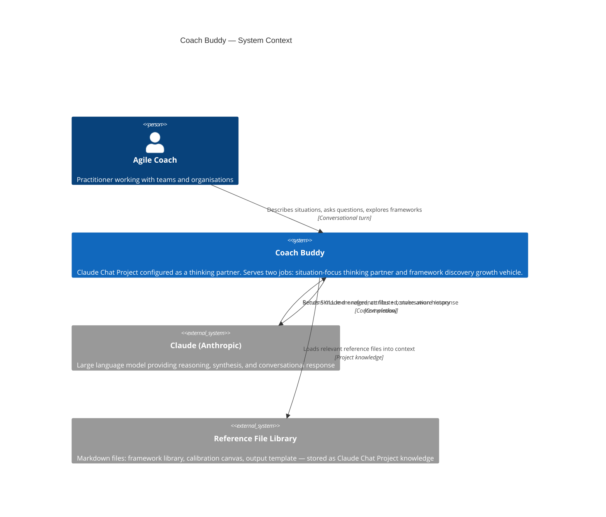
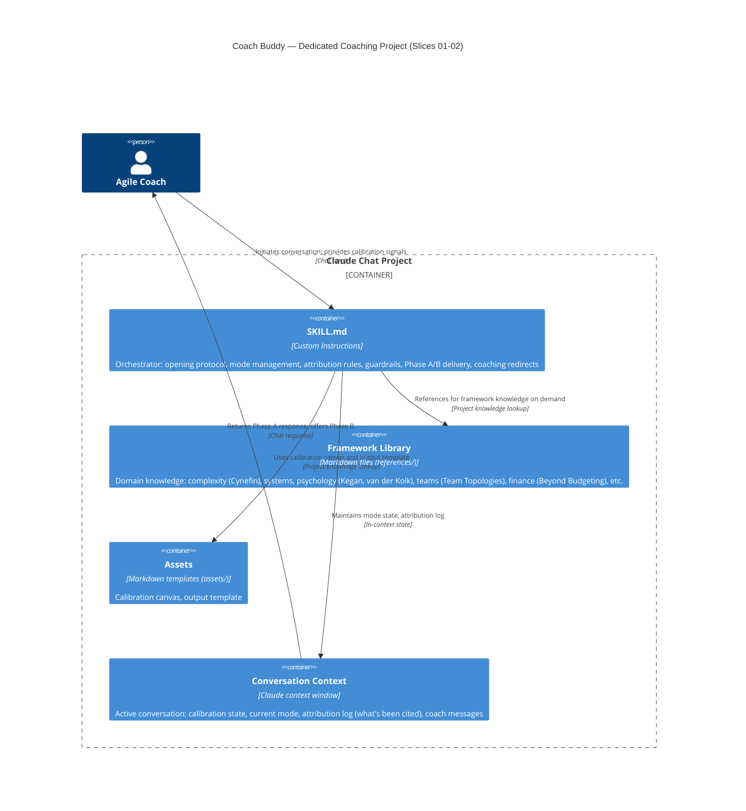
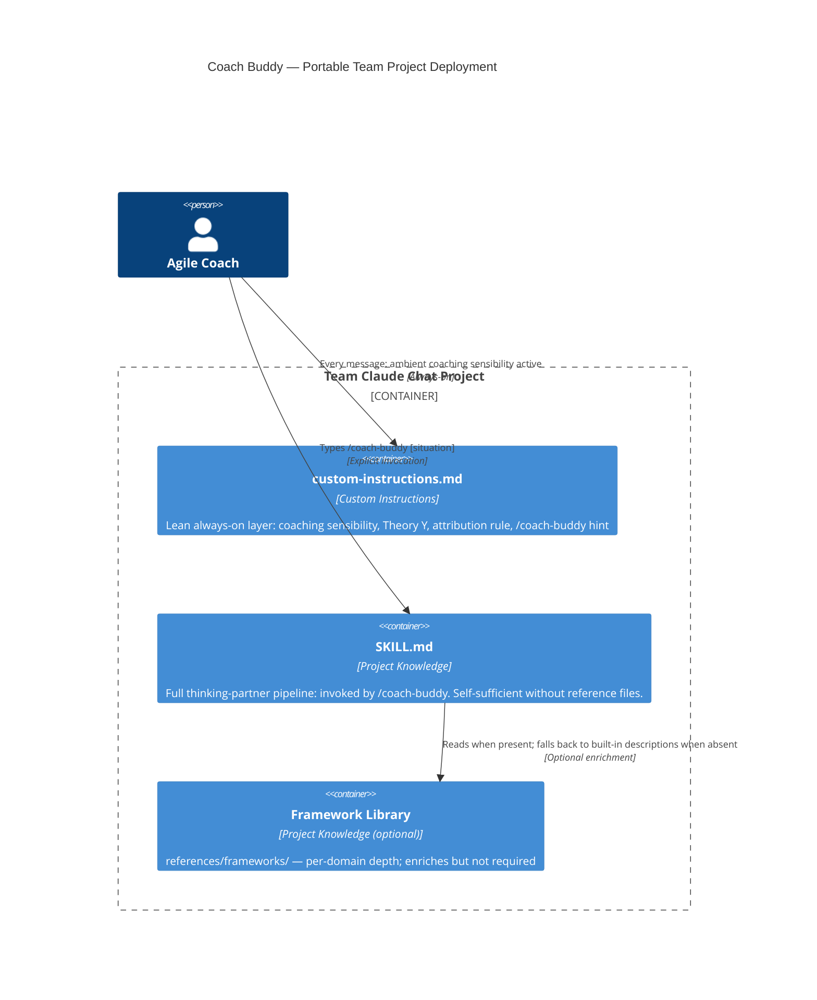
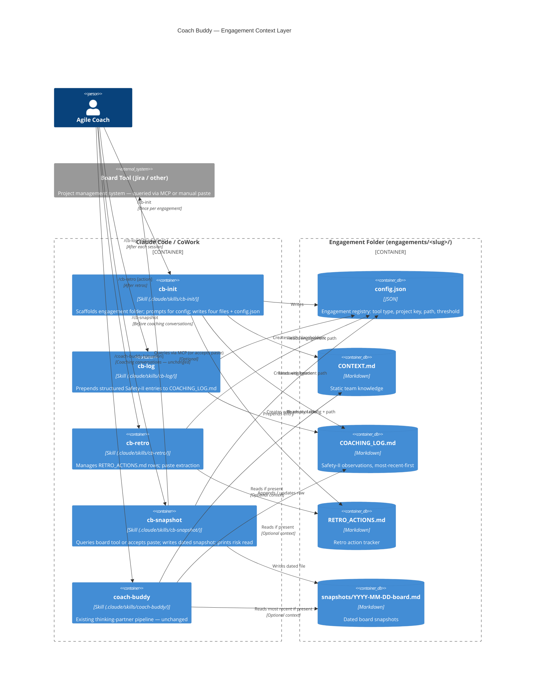
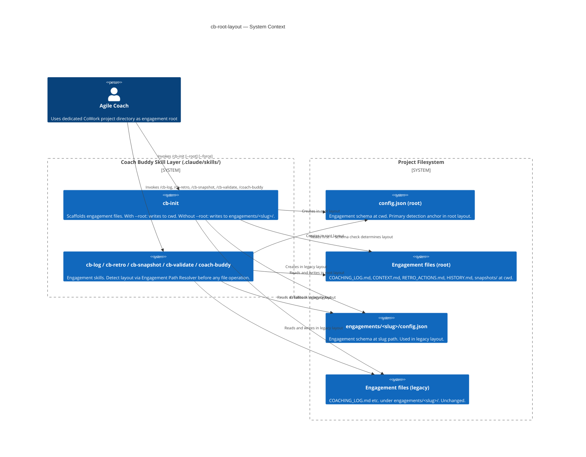
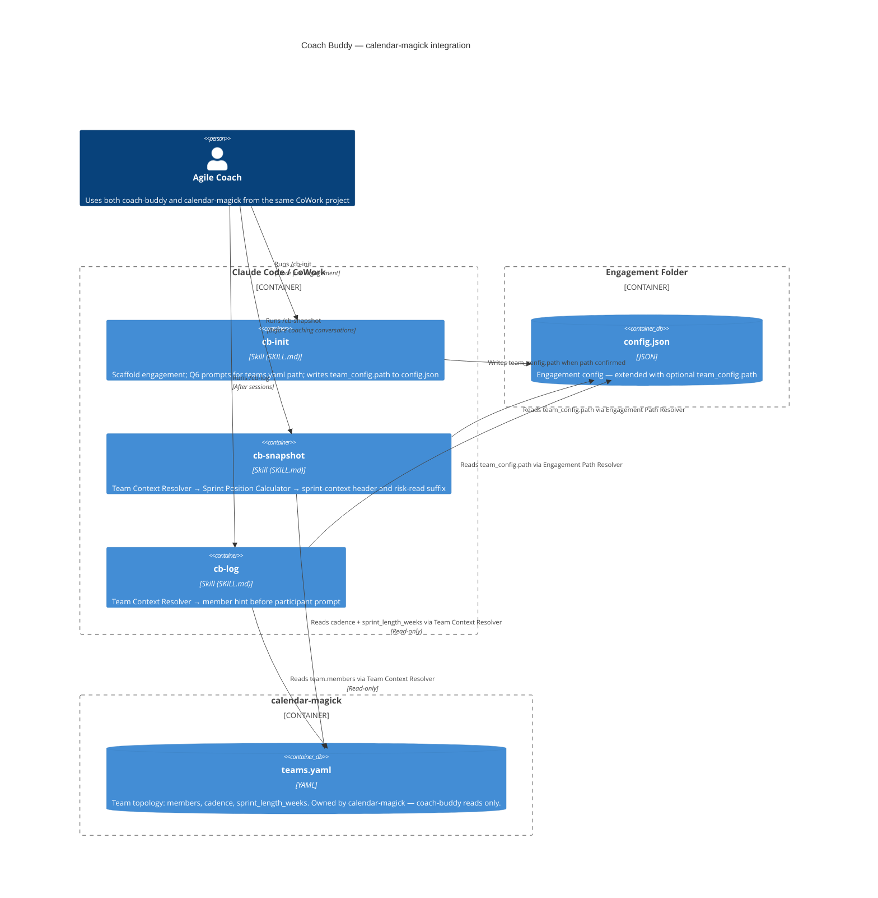
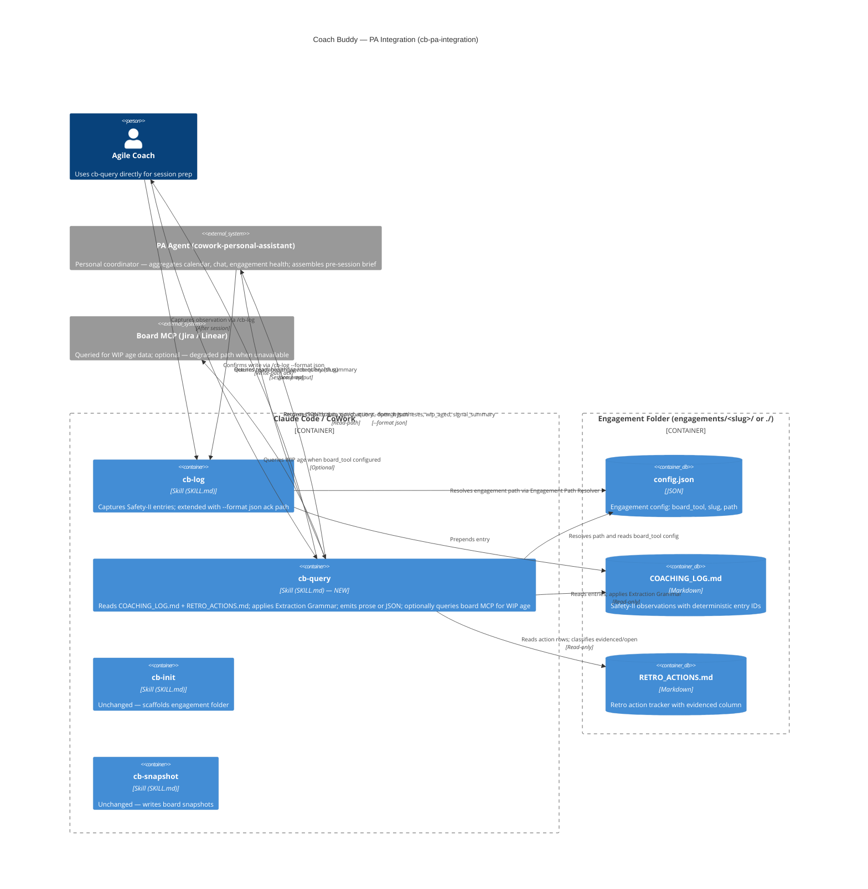

# Architecture Brief: Coach Buddy

**Feature**: coach-buddy-architecture
**Wave**: DESIGN (2026-05-12)
**Pattern**: Cutler-pattern (SKILL.md orchestrator + reference files as project knowledge)
**Quality attributes** (priority order): Transparency → Coherence → Safety

---

## Application Architecture

### System Overview

Coach Buddy is a Claude Chat Project configured as a thinking partner for Agile coaches. It is not a traditional software system — there is no code, no deployment pipeline, and no persistence layer. The "architecture" is a configuration architecture: what lives in SKILL.md, what lives in reference files, and how those two layers interact at runtime.

The design follows the Cutler-pattern: a lean orchestrator (SKILL.md) plus a reference file library. The orchestrator defines pipeline, mode management, attribution rules, and guardrails. The reference files carry domain knowledge (frameworks, lenses, intervention patterns). This separation keeps the system prompt minimal and the knowledge base maintainable.

### Component Decomposition

| Component | Location | Responsibility | Change frequency |
|-----------|----------|----------------|------------------|
| SKILL.md (Orchestrator) | Project custom instructions | Mode management, attribution rules, opening protocol, guardrails, delivery phases | Low — changes when behavioural rules change |
| Framework Library | Project knowledge: `references/frameworks/` | One file per framework domain (complexity, systems, psychology, teams, finance) | Medium — grows as repertoire expands |
| Calibration Canvas | Project knowledge: `assets/calibration-canvas.md` | Template for capturing mode/context/stakes at conversation open | Low |
| Output Template | Project knowledge: `assets/output-template.md` | Skeleton for Phase A / Phase B delivery structure | Low |

### Driving Ports (Inbound)

- **Coach message** — a conversational turn in the Claude Chat Project
- **Calibration input** — mode / context / stakes stated by the coach at conversation open

### Driven Ports (Outbound)

None in Slice 01. Coach Buddy has no external integrations in the current phase. All output is conversational.

### Technology Stack

| Layer | Choice | Rationale |
|-------|--------|-----------|
| Runtime | Claude (Anthropic) via Chat Project | Model quality for nuanced coaching conversations; no infrastructure to maintain |
| Orchestration | SKILL.md (Cutler-pattern) | Visible, editable, upgradeable; matches upgrade seam to nWave |
| Knowledge | Markdown reference files | Version-controllable, diff-readable, editable without tooling |
| Testing | Conversation review | No automated testing available in Chat Project; validation is manual |

### Reuse Analysis

This is a greenfield configuration architecture. No existing components overlap.

| Existing Component | File | Overlap | Decision | Justification |
|---|---|---|---|---|
| — | — | — | — | No prior codebase |

### Open Questions (deferred to DISTILL/DELIVER)

- How many framework files constitute the Slice 01 reference library? (Scope: enough to cover the lenses in the current system prompt; not exhaustive)
- What is the exact calibration canvas format? (Resolve in DELIVER)
- Should the Framework Library be organised by domain (complexity, psychology, teams) or by job (thinking-partner lenses vs. growth-vehicle lenses)?

---

## C4: System Context



---

## C4: Container

> **Deployment context**: This diagram represents the **dedicated coaching project** deployment (Slices 01-02), where SKILL.md is the custom instructions orchestrator. For the portable team project deployment (Slice 03, ADR-008), see the C4 Update section below — SKILL.md lives in Project Knowledge and `custom-instructions.md` is the Custom Instructions field.



---

## ADR Index

| ADR | Title | Status |
|-----|-------|--------|
| [ADR-001](adr-001-explicit-orchestration.md) | Explicit orchestration over implicit | Accepted |
| [ADR-002](adr-002-attribution-on-first-mention.md) | Attribution on first mention | Accepted |
| [ADR-003](adr-003-coaching-frames-mode-management.md) | Coaching frames for mode management | Accepted |
| [ADR-004](adr-004-ask-rather-than-assume.md) | Ask rather than assume | Accepted |
| [ADR-005](adr-005-situation-focus-high-stakes.md) | Situation focus wins at high stakes | Accepted |
| [ADR-006](adr-006-cutler-to-nwave-upgrade-seam.md) | Cutler-pattern now; nWave-pattern upgrade seam | Accepted |
| [ADR-008](adr-008-portable-install-two-layer-model.md) | Portable install — two-layer model and minimal install behaviour | Accepted |
| [ADR-009](adr-009-npx-distribution.md) | npx distribution as Wilderness Exception | Accepted |
| [ADR-010](adr-010-engagement-context-layer.md) | Engagement context layer — third deployment pattern | Accepted |
| [ADR-011](adr-011-cb-validate-inplace-validation.md) | cb-validate in-place validation strategy | Accepted |
| [ADR-012](adr-012-root-layout-cowork-placement.md) | Root layout — CoWork project placement via `--root` flag | Accepted |

---

## Application Architecture — Slice 03 (Portable Install)

**Wave**: DESIGN (2026-05-12)
**Feature**: coach-buddy-slice-03
**Pattern**: Cutler-pattern, two-layer deployment variant (ADR-008)

### Deployment Model — Portable Team Project

Slice 03 extends the existing architecture with a portable deployment variant that makes the thinking-partner pipeline available in any Claude Chat team project.

| Component | Deployment location | Role |
|-----------|---------------------|------|
| `custom-instructions.md` | Custom Instructions field | Lean always-on layer — coaching sensibility without full pipeline activation |
| `SKILL.md` | Project Knowledge | Full thinking-partner orchestrator — activated by `/coach-buddy` in any message |
| `references/frameworks/` | Project Knowledge (optional) | Per-domain framework depth — enriches but is not required |
| `assets/calibration-canvas.md` | Project Knowledge (optional) | Calibration template — optional |

### Two-Layer Architecture

The key architectural decision for Slice 03 is the separation of concerns between the always-on layer and the invocable layer:

**Layer 1 (custom-instructions.md)**: Ambient. Always active. Establishes coaching register, Theory Y stance, attribution rule, concise language. Does not activate the full pipeline. Visible to all project participants.

**Layer 2 (SKILL.md as Project Knowledge)**: Invocable. Activated by `/coach-buddy` prefix. Full thinking-partner pipeline: opening protocol, mode management, Phase A/B delivery, all ADR-encoded behaviours. Self-sufficient without reference files.

### Self-Sufficiency Guarantee (ADR-008, D8)

SKILL.md's `## Minimal install behaviour` section encodes the quality bar for minimal installs. When reference files are absent, the tool draws on built-in primary and secondary lens descriptions. Minimum reliable output: names a dynamic, makes an attribution, offers an advancing question, surfaces no error.

### Component Decomposition Update

No new components created. One extension:
- `SKILL.md`: Extended with `## Minimal install behaviour` section (10 lines)

### C4 Update — Portable Deployment



---

## Application Architecture — Slice 05 (Engagement Context Layer)

**Wave**: DESIGN (2026-05-14)
**Feature**: coach-buddy-slice-05
**Pattern**: Cutler-pattern extension — independent cb- skill invocables + markdown file persistence (ADR-010)

### Third Deployment Pattern

Slice 05 adds a persistent engagement context layer that can be layered on top of either existing deployment pattern (dedicated project or portable team project install).

| Deployment pattern | File | Role |
|---|---|---|
| Dedicated coaching project | `SKILL.md` as Custom Instructions | Full pipeline always-on |
| Portable team project | `custom-instructions.md` + `SKILL.md` in Knowledge | Two-layer ambient + invocable |
| **Engagement context layer** | **`skills/cb-*/SKILL.md`** | **Four independent invocables for persistent engagement management** |

### Component Decomposition

| Component | Repo location | Install location | Responsibility |
|-----------|--------------|-----------------|----------------|
| `cb-init` | `skills/cb-init/SKILL.md` | `.claude/skills/cb-init/SKILL.md` | Scaffold engagement folder; write config.json and four template files |
| `cb-log` | `skills/cb-log/SKILL.md` | `.claude/skills/cb-log/SKILL.md` | Prepend Safety-II entries to COACHING_LOG.md; quick capture + update |
| `cb-retro` | `skills/cb-retro/SKILL.md` | `.claude/skills/cb-retro/SKILL.md` | Append/update rows in RETRO_ACTIONS.md; paste extraction |
| `cb-snapshot` | `skills/cb-snapshot/SKILL.md` | `.claude/skills/cb-snapshot/SKILL.md` | Write dated board snapshot; tool-agnostic (Jira ref + paste fallback); risk read |
| `coaching-log-format.md` | `references/coaching-practice/` | Project Knowledge (optional) | Safety-II rationale for log field structure |
| `board-snapshot-guide.md` | `references/coaching-practice/` | Project Knowledge (optional) | How to read and use a snapshot in coaching |

### Engagement Data Layout (user's project, not in package)

```
engagements/
  <team-slug>/
    config.json           ← written by cb-init; read by all downstream skills
    CONTEXT.md            ← static team knowledge (manual)
    COACHING_LOG.md       ← Safety-II observations, most-recent-first
    RETRO_ACTIONS.md      ← retro action tracker
    HISTORY.md            ← team lineage
    snapshots/
      YYYY-MM-DD-board.md ← written by cb-snapshot
```

### C4 Update — Engagement Context Layer



---

## Application Architecture — cb-review-improvements

**Wave**: DESIGN (2026-05-15)
**Feature**: cb-review-improvements
**Pattern**: Cutler-pattern extension (ADR-010); additive engagement layer improvements

### Summary

Adds `cb-validate` (new skill) and extends `cb-snapshot`, `cb-log`, `cb-init` with three targeted improvements:
hypothesis validation loop, coaching context in snapshots, advisory mode tracking, and structured stakeholder template.

### Component Changes

| Component | Change | Key detail |
|-----------|--------|------------|
| `cb-validate` (new) | CREATE NEW | Reads COACHING_LOG.md; groups hypotheses by age (>14d / 7-14d / <7d); interactive validation loop; writes `**Validation**: {status} ({date})` in-place via id-match mechanism |
| `cb-snapshot` | EXTEND | After snapshot write: reads 3 most recent COACHING_LOG entries; appends `## Relevant coaching context` section to snapshot file. Graceful no-op if COACHING_LOG absent. |
| `cb-log` | EXTEND | Accepts `--mode thinking-partner\|advisory\|facilitation`; writes `mode:` field to entry frontmatter; defaults to `thinking-partner` |
| `cb-init` | EXTEND | CONTEXT.md Stakeholders section: flat comment → 4-column table (Role, Influence, Inclusion notes, External pressures) + "Who am I NOT seeing?" prompt |

### COACHING_LOG.md Entry Format Update

The entry format gains two optional fields (`mode` and `**Validation**`). Existing entries without these fields remain valid — both fields are optional and skipped gracefully.

```markdown
---
id: YYYY-MM-DD-NNN
date: YYYY-MM-DD
mode: thinking-partner          ← written by cb-log (new, optional)

**Observed**: ...
**Hypothesis**: If [X] then [Y]
**Validation**: confirmed (YYYY-MM-DD)   ← written by cb-validate (new, optional)
---
```

### ADR Index Update

| ADR | Title | Status |
|-----|-------|--------|
| [ADR-011](adr-011-cb-validate-inplace-validation.md) | cb-validate in-place validation strategy | Accepted |

---

## Application Architecture — cb-root-layout

**Wave**: DESIGN (2026-05-19)
**Feature**: cb-root-layout
**Pattern**: Cutler-pattern extension (ADR-010, ADR-012); additive path-resolution layer

### Summary

Adds root-layout support to all six engagement skills. The change surface is SKILL.md prose only — no new files, no new deployment units, no domain model changes.

Two-part delivery:
- **Slice 01**: `cb-init` gains `--root` flag; engagement files scaffold at cwd with no `engagements/` wrapper
- **Slice 02**: all five downstream skills (`cb-log`, `cb-retro`, `cb-snapshot`, `cb-validate`, `coach-buddy`) gain the Engagement Path Resolver pattern for layout-transparent file access

### Layout Variants

| Layout | Triggered by | Detection anchor | Engagement file root |
|---|---|---|---|
| Root layout | `cb-init --root` | `./config.json` (schema: `version` + `engagement.slug`) | `./` (cwd) |
| Legacy layout | `cb-init` (no flag) | `engagements/<slug>/config.json` | `engagements/<slug>/` |

Both layouts coexist transparently. Legacy layout is unchanged.

### Shared Detection Pattern: Engagement Path Resolver

The detection logic is identical across all five downstream skills. Each SKILL.md embeds the following named pattern verbatim under `## Reading the engagement config`:

1. Attempt to read `./config.json`. If it exists and contains `version` and `engagement.slug`, this is root layout — set `engagement_path = ./`, skip Step 2.
2. Otherwise, use existing `engagements/<slug>/config.json` discovery (slug from `--slug` flag, single-folder auto-select, or disambiguation prompt).
3. If neither yields a config, surface: "No engagement found at `./config.json` or `engagements/<slug>/config.json`. Run `/cb-init` or `/cb-init --root`."

The pattern is embedded verbatim (not extracted to a shared reference file) because SKILL.md self-containment is a design invariant from ADR-008 — skills must not depend on external reference files being present.

### Component Changes

| Component | Change | Key detail |
|---|---|---|
| `cb-init` | EXTEND | `--root` flag; conditional overwrite guard path; conditional file target paths; collision warning for `COACHING_LOG.md` |
| `cb-log` | EXTEND | Engagement Path Resolver replaces hardcoded `engagements/<slug>/` read |
| `cb-retro` | EXTEND | Engagement Path Resolver replaces hardcoded `engagements/<slug>/` read |
| `cb-snapshot` | EXTEND | Engagement Path Resolver replaces hardcoded `engagements/<slug>/` read; snapshot and coaching-context paths use `{engagement_path}` variable |
| `cb-validate` | EXTEND | Engagement Path Resolver replaces hardcoded `engagements/<slug>/` read |
| `coach-buddy` | EXTEND | New `## Engagement context (optional)` section (after `## Core stance`, before `## Mode management`); Engagement Path Resolver applied silently; no error if no engagement found |

### Engagement Data Layout (both variants)

```
Root layout (cb-init --root):          Legacy layout (cb-init):
  ./config.json                          engagements/<slug>/config.json
  ./CONTEXT.md                           engagements/<slug>/CONTEXT.md
  ./COACHING_LOG.md                      engagements/<slug>/COACHING_LOG.md
  ./RETRO_ACTIONS.md                     engagements/<slug>/RETRO_ACTIONS.md
  ./HISTORY.md                           engagements/<slug>/HISTORY.md
  ./snapshots/                           engagements/<slug>/snapshots/
```

### ADR Index Update

| ADR | Title | Status |
|-----|-------|--------|
| [ADR-012](adr-012-root-layout-cowork-placement.md) | Root layout — CoWork project placement via `--root` flag | Accepted |

### C4: System Context — cb-root-layout



---

## Application Architecture — calendar-magick-integration

**Wave**: DESIGN (2026-05-19)
**Feature**: calendar-magick-integration
**Pattern**: Cutler-pattern extension (ADR-010, ADR-013); read-only external file integration via inline Team Context Resolver sub-pattern

### Summary

Extends three existing skills (`cb-init`, `cb-snapshot`, `cb-log`) to optionally read a `teams.yaml` file maintained by the companion tool calendar-magick. coach-buddy is read-only. calendar-magick owns the write path. The integration is opt-in: engagements without `team_config.path` in their config.json see zero behaviour change.

The change surface is SKILL.md prose only. No new SKILL.md files are created.

### config.json Schema Extension

```json
{
  "version": 1,
  "engagement": { "name": "...", "slug": "...", "created": "..." },
  "tool": { "type": "...", "project_key": "...", "board_id": "...", "wip_age_threshold_days": 5 },
  "team_config": {
    "path": "../../calendar-magick/teams/phoenix/config.yaml"
  }
}
```

`team_config` is an optional top-level peer key alongside `tool` and `engagement`. When absent, all downstream skill behaviour is unchanged. `path` is relative to the engagement root (the directory containing `config.json`), following D4.

### New Sub-Pattern: Team Context Resolver

A named prose sub-pattern embedded verbatim in cb-snapshot and cb-log (per ADR-008 self-containment invariant). Executes after the Engagement Path Resolver completes and config.json is loaded.

The pattern exposes three values to the calling skill:
- `team_cadence` — string (`"scrum"` / `"kanban"` / null)
- `team_sprint_weeks` — integer / null
- `team_members` — array of `{name, role}` / empty array

Silent degradation: if `team_config` is absent from config, if the file cannot be read, or if any field is missing — the resolver sets the relevant value to null/empty and continues. No error is surfaced.

### Sprint Position Calculator

A deterministic prose algorithm embedded in cb-snapshot. Derives sprint day and week from `team_sprint_weeks` + today's date. No stored sprint start date.

Epoch anchor: 2020-01-06 (Monday). Sprint cycle index = `floor((today_week_monday − epoch) / 7) mod N`. Weekend handling: Saturday/Sunday freeze at Friday's position. See ADR-013 for rationale.

### Component Changes

| Component | Change | Key detail |
|-----------|--------|------------|
| `cb-init` | EXTEND | Q6 added after Q5 (WIP threshold): detect `teams/*/config.yaml` → suggest path; or prompt for manual entry; validate file exists; write `team_config` to config.json |
| `cb-snapshot` | EXTEND | Team Context Resolver after config read; Sprint Position Calculator when cadence=scrum; header line gains sprint suffix; risk read gains sprint suffix |
| `cb-log` | EXTEND | Team Context Resolver after config read; member hint displayed before "Who was in the session?" when team_members is non-empty |
| `config.json` | EXTEND | New optional top-level `team_config: {path}` key |

### ADR Index Update

| ADR | Title | Status |
|-----|-------|--------|
| [ADR-013](adr-013-sprint-position-epoch-anchor.md) | Sprint position epoch anchor — deterministic cadence derivation without stored state | Accepted |
| [ADR-014](adr-014-cb-query-extraction-grammar.md) | cb-query Named Extraction Grammar — scoped signal_summary and rule-derived field extraction | Accepted (shipped v1.10.0) |

### C4: Container — calendar-magick-integration



---

## Application Architecture — cb-pa-integration

**Wave**: DESIGN (2026-06-03)
**Feature**: cb-pa-integration
**Pattern**: Cutler-pattern extension (ADR-010); structured JSON output ports for agent-to-agent integration

### Summary

Extends `cb-log` with a `--format json` output path and creates a new `cb-query` skill. Together these form the machine-readable interface between coach-buddy (team specialist) and a PA agent (personal coordinator). The PA calls cb-log to confirm writes and cb-query to retrieve engagement health data. Coach-buddy generates summaries scoped to engagement-health domain only (DW-1, DW-2); the PA synthesises across its own sources.

The change surface is SKILL.md prose only. No new files, no new deployment units, no change to COACHING_LOG.md format.

### Component Decomposition

| Component | Change | Key detail |
|-----------|--------|------------|
| `cb-log` | EXTEND | Add `--format json` output branch: emits JSON ack on success/error; all other paths unchanged |
| `cb-query` | CREATE NEW | Read-only skill: reads `COACHING_LOG.md` + `RETRO_ACTIONS.md`; optionally calls board MCP; emits prose (default) or JSON (`--format json`) |

### Driving Ports (Inbound)

| Port | Invoker | Arguments |
|------|---------|-----------|
| `/cb-log --format json` | PA agent (write-path confirm) | `--slug`, `--text`, `--format json`; existing args unchanged |
| `/cb-query {slug}` | Coach (human, readable output) | `--slug`, `--since` (default 14d) |
| `/cb-query --format json` | PA agent (read-path) | `--slug`, `--format json`, `--since` |

### Driven Ports + Adapters

| Port | Adapter | Behaviour |
|------|---------|-----------|
| Engagement Path Resolver | Embedded verbatim in cb-query (ADR-008) | Step 1 root layout → Step 2 legacy layout → Step 3 error; identical to cb-log |
| `COACHING_LOG.md` reader | LLM file read in cb-query | Reads file; Extraction Grammar applied post-read |
| `RETRO_ACTIONS.md` reader | LLM file read in cb-query | Reads table; extracts open/evidenced actions |
| Board MCP adapter | Jira or Linear MCP call in cb-query | Called when `config.json` sets `board_tool`; absent → `wip_aged: []` + `warnings` populated (degraded path) |

### Technology Stack

| Layer | Choice | Rationale |
|-------|--------|-----------|
| Runtime | Claude Code / CoWork (LLM skill invocation) | Existing pattern; no change |
| Skill format | SKILL.md (Cutler-pattern) | All existing skills use this; zero new tooling |
| Persistence | COACHING_LOG.md, RETRO_ACTIONS.md (markdown) | Existing format; cb-query is read-only |
| Output serialisation | Inline JSON template in SKILL.md prose | No library needed; LLM emits conformant JSON per embedded schema definition |
| Board integration | Existing Jira/Linear MCP | Already used by cb-snapshot; cb-query reuses same adapter pattern |

### Reuse Analysis

| Existing Component | File | Overlap | Decision | Justification |
|---|---|---|---|---|
| `cb-log` write path | `skills/cb-log/SKILL.md` | US-001 output branch | EXTEND | All write logic, path resolution, and entry format unchanged; only stdout path is new |
| Engagement Path Resolver | Embedded in cb-log | cb-query needs layout-transparent path resolution | EMBED VERBATIM | ADR-008 self-containment invariant; copy Steps 1–3 prose from cb-log into cb-query |
| Team Context Resolver | Embedded in cb-log, cb-snapshot | cb-query needs `board_tool` from config.json | PARTIAL REUSE | cb-query reads config.json for `board_tool` only; does not need teams.yaml; resolver simplified to config-read only |
| `COACHING_LOG.md` entry format | cb-log-deterministic-writes (shipped) | cb-query reads these entries | REUSE (prerequisite) | Deterministic `id: YYYY-MM-DD-NNN` + field-anchor format is the stable substrate for Extraction Grammar |
| `cb-snapshot` board MCP call | `skills/cb-snapshot/SKILL.md` | cb-query also calls board MCP for WIP age | NOT REUSED | cb-query is a read/summarise skill; board call is inline per self-containment; cb-snapshot not a shared library |
| `cb-validate` hypothesis reader | `skills/cb-validate/SKILL.md` | Both read hypothesis fields | NOT REUSED | cb-validate writes in-place; cb-query reads and reports; no shared logic path |

### ADR Index Update

| ADR | Title | Status |
|-----|-------|--------|
| [ADR-014](adr-014-cb-query-extraction-grammar.md) | cb-query Named Extraction Grammar — scoped signal_summary and rule-derived field extraction | Accepted |

### C4: Container — cb-pa-integration


