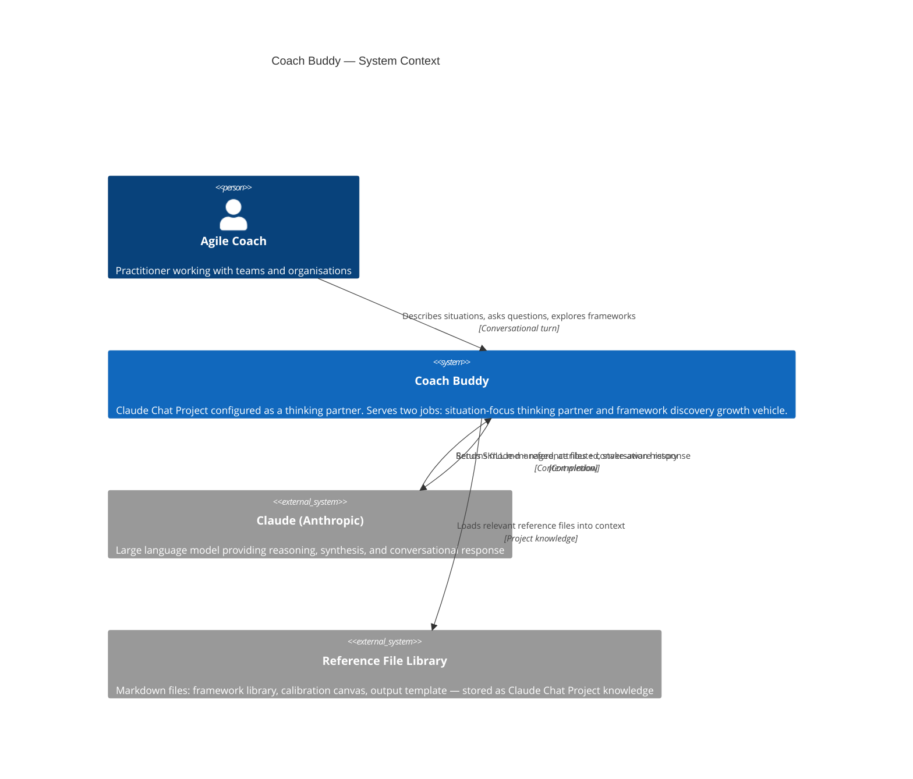
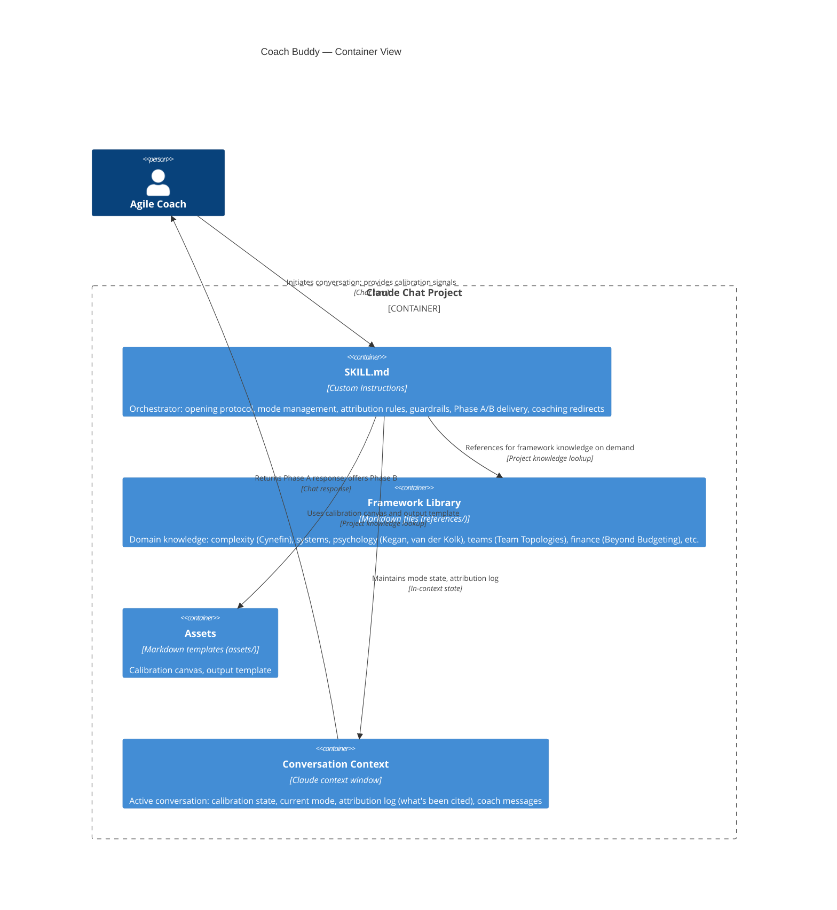

# Architecture Brief: Coach Buddy

**Feature**: coach-buddy-architecture
**Wave**: DESIGN (2026-05-12)
**Pattern**: Cutler-pattern (SKILL.md orchestrator + reference files as project knowledge)
**Quality attributes** (priority order): Transparency → Coherence → Safety

---

## Application Architecture

### System Overview

Coach Buddy is a Claude Chat Project configured as a thinking partner for Agile coaches. It is not a traditional software system — there is no code, no deployment pipeline, and no persistence layer. The "architecture" is a configuration architecture: what lives in SKILL.md, what lives in reference files, and how those two layers interact at runtime.

The design follows the Cutler-pattern: a lean orchestrator (SKILL.md) plus a reference file library. The orchestrator defines pipeline, mode management, attribution rules, and guardrails. The reference files carry domain knowledge (frameworks, lenses, intervention patterns). This separation keeps the system prompt minimal and the knowledge base maintainable.

### Component Decomposition

| Component | Location | Responsibility | Change frequency |
|-----------|----------|----------------|------------------|
| SKILL.md (Orchestrator) | Project custom instructions | Mode management, attribution rules, opening protocol, guardrails, delivery phases | Low — changes when behavioural rules change |
| Framework Library | Project knowledge: `references/frameworks/` | One file per framework domain (complexity, systems, psychology, teams, finance) | Medium — grows as repertoire expands |
| Calibration Canvas | Project knowledge: `assets/calibration-canvas.md` | Template for capturing mode/context/stakes at conversation open | Low |
| Output Template | Project knowledge: `assets/output-template.md` | Skeleton for Phase A / Phase B delivery structure | Low |

### Driving Ports (Inbound)

- **Coach message** — a conversational turn in the Claude Chat Project
- **Calibration input** — mode / context / stakes stated by the coach at conversation open

### Driven Ports (Outbound)

None in Slice 01. Coach Buddy has no external integrations in the current phase. All output is conversational.

### Technology Stack

| Layer | Choice | Rationale |
|-------|--------|-----------|
| Runtime | Claude (Anthropic) via Chat Project | Model quality for nuanced coaching conversations; no infrastructure to maintain |
| Orchestration | SKILL.md (Cutler-pattern) | Visible, editable, upgradeable; matches upgrade seam to nWave |
| Knowledge | Markdown reference files | Version-controllable, diff-readable, editable without tooling |
| Testing | Conversation review | No automated testing available in Chat Project; validation is manual |

### Reuse Analysis

This is a greenfield configuration architecture. No existing components overlap.

| Existing Component | File | Overlap | Decision | Justification |
|---|---|---|---|---|
| — | — | — | — | No prior codebase |

### Open Questions (deferred to DISTILL/DELIVER)

- How many framework files constitute the Slice 01 reference library? (Scope: enough to cover the lenses in the current system prompt; not exhaustive)
- What is the exact calibration canvas format? (Resolve in DELIVER)
- Should the Framework Library be organised by domain (complexity, psychology, teams) or by job (thinking-partner lenses vs. growth-vehicle lenses)?

---

## C4: System Context

---

## C4: Container

---

## ADR Index

| ADR | Title | Status |
|-----|-------|--------|
| [ADR-001](adr-001-explicit-orchestration.md) | Explicit orchestration over implicit | Accepted |
| [ADR-002](adr-002-attribution-on-first-mention.md) | Attribution on first mention | Accepted |
| [ADR-003](adr-003-coaching-frames-mode-management.md) | Coaching frames for mode management | Accepted |
| [ADR-004](adr-004-ask-rather-than-assume.md) | Ask rather than assume | Accepted |
| [ADR-005](adr-005-situation-focus-high-stakes.md) | Situation focus wins at high stakes | Accepted |
| [ADR-006](adr-006-cutler-to-nwave-upgrade-seam.md) | Cutler-pattern now; nWave-pattern upgrade seam | Accepted |
