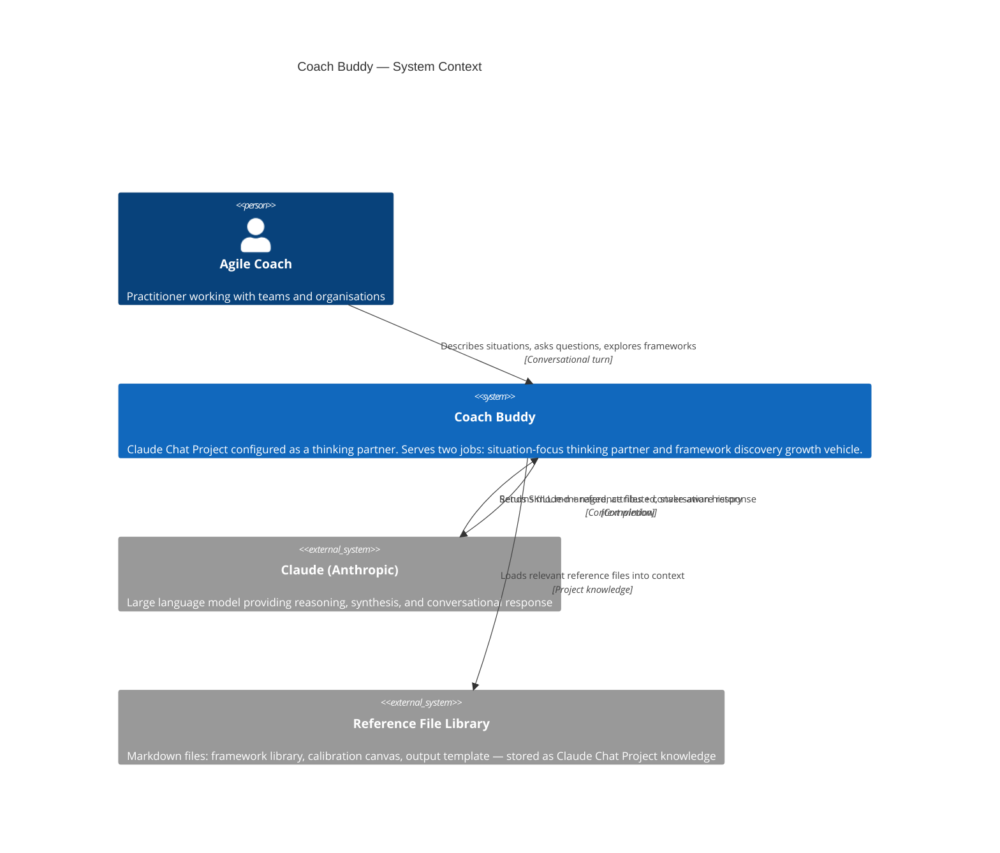
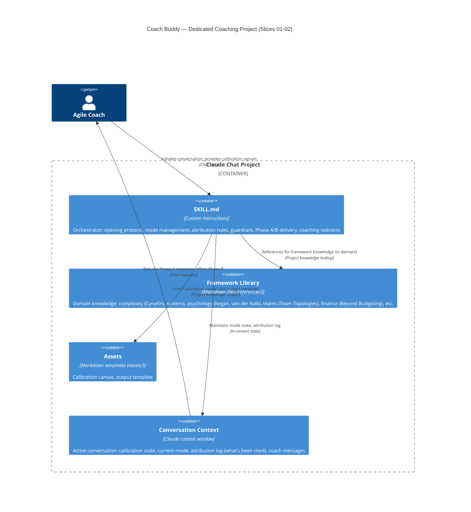
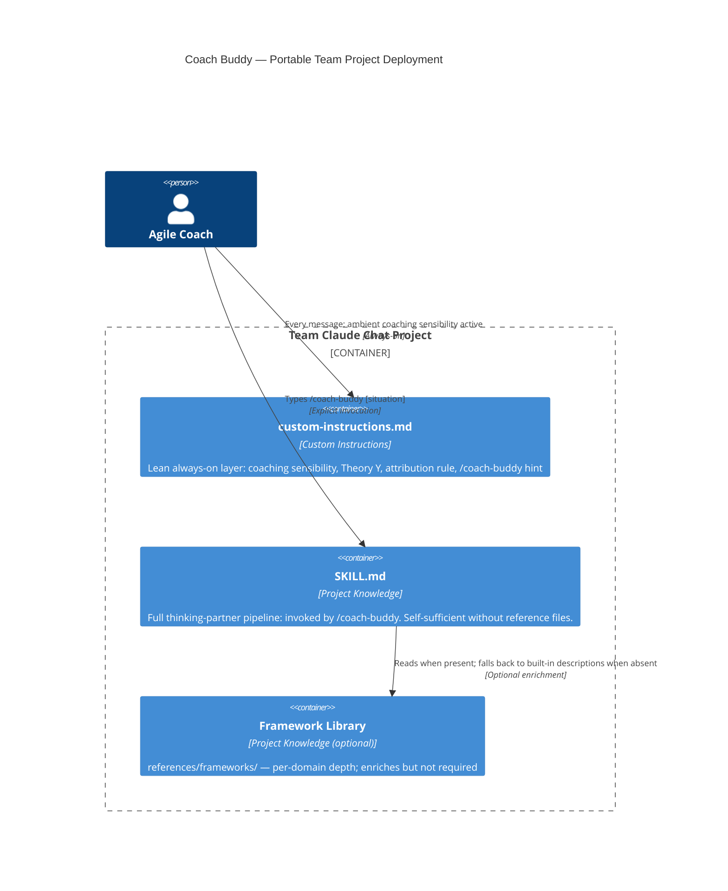
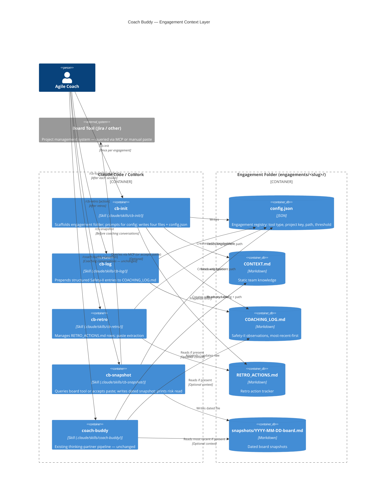

# Architecture Brief: Coach Buddy

**Feature**: coach-buddy-architecture
**Wave**: DESIGN (2026-05-12)
**Pattern**: Cutler-pattern (SKILL.md orchestrator + reference files as project knowledge)
**Quality attributes** (priority order): Transparency → Coherence → Safety

---

## Application Architecture

### System Overview

Coach Buddy is a Claude Chat Project configured as a thinking partner for Agile coaches. It is not a traditional software system — there is no code, no deployment pipeline, and no persistence layer. The "architecture" is a configuration architecture: what lives in SKILL.md, what lives in reference files, and how those two layers interact at runtime.

The design follows the Cutler-pattern: a lean orchestrator (SKILL.md) plus a reference file library. The orchestrator defines pipeline, mode management, attribution rules, and guardrails. The reference files carry domain knowledge (frameworks, lenses, intervention patterns). This separation keeps the system prompt minimal and the knowledge base maintainable.

### Component Decomposition

| Component | Location | Responsibility | Change frequency |
|-----------|----------|----------------|------------------|
| SKILL.md (Orchestrator) | Project custom instructions | Mode management, attribution rules, opening protocol, guardrails, delivery phases | Low — changes when behavioural rules change |
| Framework Library | Project knowledge: `references/frameworks/` | One file per framework domain (complexity, systems, psychology, teams, finance) | Medium — grows as repertoire expands |
| Calibration Canvas | Project knowledge: `assets/calibration-canvas.md` | Template for capturing mode/context/stakes at conversation open | Low |
| Output Template | Project knowledge: `assets/output-template.md` | Skeleton for Phase A / Phase B delivery structure | Low |

### Driving Ports (Inbound)

- **Coach message** — a conversational turn in the Claude Chat Project
- **Calibration input** — mode / context / stakes stated by the coach at conversation open

### Driven Ports (Outbound)

None in Slice 01. Coach Buddy has no external integrations in the current phase. All output is conversational.

### Technology Stack

| Layer | Choice | Rationale |
|-------|--------|-----------|
| Runtime | Claude (Anthropic) via Chat Project | Model quality for nuanced coaching conversations; no infrastructure to maintain |
| Orchestration | SKILL.md (Cutler-pattern) | Visible, editable, upgradeable; matches upgrade seam to nWave |
| Knowledge | Markdown reference files | Version-controllable, diff-readable, editable without tooling |
| Testing | Conversation review | No automated testing available in Chat Project; validation is manual |

### Reuse Analysis

This is a greenfield configuration architecture. No existing components overlap.

| Existing Component | File | Overlap | Decision | Justification |
|---|---|---|---|---|
| — | — | — | — | No prior codebase |

### Open Questions (deferred to DISTILL/DELIVER)

- How many framework files constitute the Slice 01 reference library? (Scope: enough to cover the lenses in the current system prompt; not exhaustive)
- What is the exact calibration canvas format? (Resolve in DELIVER)
- Should the Framework Library be organised by domain (complexity, psychology, teams) or by job (thinking-partner lenses vs. growth-vehicle lenses)?

---

## C4: System Context



---

## C4: Container

> **Deployment context**: This diagram represents the **dedicated coaching project** deployment (Slices 01-02), where SKILL.md is the custom instructions orchestrator. For the portable team project deployment (Slice 03, ADR-008), see the C4 Update section below — SKILL.md lives in Project Knowledge and `custom-instructions.md` is the Custom Instructions field.



---

## ADR Index

| ADR | Title | Status |
|-----|-------|--------|
| [ADR-001](adr-001-explicit-orchestration.md) | Explicit orchestration over implicit | Accepted |
| [ADR-002](adr-002-attribution-on-first-mention.md) | Attribution on first mention | Accepted |
| [ADR-003](adr-003-coaching-frames-mode-management.md) | Coaching frames for mode management | Accepted |
| [ADR-004](adr-004-ask-rather-than-assume.md) | Ask rather than assume | Accepted |
| [ADR-005](adr-005-situation-focus-high-stakes.md) | Situation focus wins at high stakes | Accepted |
| [ADR-006](adr-006-cutler-to-nwave-upgrade-seam.md) | Cutler-pattern now; nWave-pattern upgrade seam | Accepted |
| [ADR-008](adr-008-portable-install-two-layer-model.md) | Portable install — two-layer model and minimal install behaviour | Accepted |
| [ADR-009](adr-009-npx-distribution.md) | npx distribution as Wilderness Exception | Accepted |
| [ADR-010](adr-010-engagement-context-layer.md) | Engagement context layer — third deployment pattern | Accepted |

---

## Application Architecture — Slice 03 (Portable Install)

**Wave**: DESIGN (2026-05-12)
**Feature**: coach-buddy-slice-03
**Pattern**: Cutler-pattern, two-layer deployment variant (ADR-008)

### Deployment Model — Portable Team Project

Slice 03 extends the existing architecture with a portable deployment variant that makes the thinking-partner pipeline available in any Claude Chat team project.

| Component | Deployment location | Role |
|-----------|---------------------|------|
| `custom-instructions.md` | Custom Instructions field | Lean always-on layer — coaching sensibility without full pipeline activation |
| `SKILL.md` | Project Knowledge | Full thinking-partner orchestrator — activated by `/coach-buddy` in any message |
| `references/frameworks/` | Project Knowledge (optional) | Per-domain framework depth — enriches but is not required |
| `assets/calibration-canvas.md` | Project Knowledge (optional) | Calibration template — optional |

### Two-Layer Architecture

The key architectural decision for Slice 03 is the separation of concerns between the always-on layer and the invocable layer:

**Layer 1 (custom-instructions.md)**: Ambient. Always active. Establishes coaching register, Theory Y stance, attribution rule, concise language. Does not activate the full pipeline. Visible to all project participants.

**Layer 2 (SKILL.md as Project Knowledge)**: Invocable. Activated by `/coach-buddy` prefix. Full thinking-partner pipeline: opening protocol, mode management, Phase A/B delivery, all ADR-encoded behaviours. Self-sufficient without reference files.

### Self-Sufficiency Guarantee (ADR-008, D8)

SKILL.md's `## Minimal install behaviour` section encodes the quality bar for minimal installs. When reference files are absent, the tool draws on built-in primary and secondary lens descriptions. Minimum reliable output: names a dynamic, makes an attribution, offers an advancing question, surfaces no error.

### Component Decomposition Update

No new components created. One extension:
- `SKILL.md`: Extended with `## Minimal install behaviour` section (10 lines)

### C4 Update — Portable Deployment



---

## Application Architecture — Slice 05 (Engagement Context Layer)

**Wave**: DESIGN (2026-05-14)
**Feature**: coach-buddy-slice-05
**Pattern**: Cutler-pattern extension — independent cb- skill invocables + markdown file persistence (ADR-010)

### Third Deployment Pattern

Slice 05 adds a persistent engagement context layer that can be layered on top of either existing deployment pattern (dedicated project or portable team project install).

| Deployment pattern | File | Role |
|---|---|---|
| Dedicated coaching project | `SKILL.md` as Custom Instructions | Full pipeline always-on |
| Portable team project | `custom-instructions.md` + `SKILL.md` in Knowledge | Two-layer ambient + invocable |
| **Engagement context layer** | **`skills/cb-*/SKILL.md`** | **Four independent invocables for persistent engagement management** |

### Component Decomposition

| Component | Repo location | Install location | Responsibility |
|-----------|--------------|-----------------|----------------|
| `cb-init` | `skills/cb-init/SKILL.md` | `.claude/skills/cb-init/SKILL.md` | Scaffold engagement folder; write config.json and four template files |
| `cb-log` | `skills/cb-log/SKILL.md` | `.claude/skills/cb-log/SKILL.md` | Prepend Safety-II entries to COACHING_LOG.md; quick capture + update |
| `cb-retro` | `skills/cb-retro/SKILL.md` | `.claude/skills/cb-retro/SKILL.md` | Append/update rows in RETRO_ACTIONS.md; paste extraction |
| `cb-snapshot` | `skills/cb-snapshot/SKILL.md` | `.claude/skills/cb-snapshot/SKILL.md` | Write dated board snapshot; tool-agnostic (Jira ref + paste fallback); risk read |
| `coaching-log-format.md` | `references/coaching-practice/` | Project Knowledge (optional) | Safety-II rationale for log field structure |
| `board-snapshot-guide.md` | `references/coaching-practice/` | Project Knowledge (optional) | How to read and use a snapshot in coaching |

### Engagement Data Layout (user's project, not in package)

```
engagements/
  <team-slug>/
    config.json           ← written by cb-init; read by all downstream skills
    CONTEXT.md            ← static team knowledge (manual)
    COACHING_LOG.md       ← Safety-II observations, most-recent-first
    RETRO_ACTIONS.md      ← retro action tracker
    HISTORY.md            ← team lineage
    snapshots/
      YYYY-MM-DD-board.md ← written by cb-snapshot
```

### C4 Update — Engagement Context Layer



---

## Application Architecture — cb-review-improvements

**Wave**: DESIGN (2026-05-15)
**Feature**: cb-review-improvements
**Pattern**: Cutler-pattern extension (ADR-010); additive engagement layer improvements

### Summary

Adds `cb-validate` (new skill) and extends `cb-snapshot`, `cb-log`, `cb-init` with three targeted improvements:
hypothesis validation loop, coaching context in snapshots, advisory mode tracking, and structured stakeholder template.

### Component Changes

| Component | Change | Key detail |
|-----------|--------|------------|
| `cb-validate` (new) | CREATE NEW | Reads COACHING_LOG.md; groups hypotheses by age (>14d / 7-14d / <7d); interactive validation loop; writes `**Validation**: {status} ({date})` in-place via id-match mechanism |
| `cb-snapshot` | EXTEND | After snapshot write: reads 3 most recent COACHING_LOG entries; appends `## Relevant coaching context` section to snapshot file. Graceful no-op if COACHING_LOG absent. |
| `cb-log` | EXTEND | Accepts `--mode thinking-partner\|advisory\|facilitation`; writes `mode:` field to entry frontmatter; defaults to `thinking-partner` |
| `cb-init` | EXTEND | CONTEXT.md Stakeholders section: flat comment → 4-column table (Role, Influence, Inclusion notes, External pressures) + "Who am I NOT seeing?" prompt |

### COACHING_LOG.md Entry Format Update

The entry format gains two optional fields (`mode` and `**Validation**`). Existing entries without these fields remain valid — both fields are optional and skipped gracefully.

```markdown
---
id: YYYY-MM-DD-NNN
date: YYYY-MM-DD
mode: thinking-partner          ← written by cb-log (new, optional)

**Observed**: ...
**Hypothesis**: If [X] then [Y]
**Validation**: confirmed (YYYY-MM-DD)   ← written by cb-validate (new, optional)
---
```

### ADR Index Update

| ADR | Title | Status |
|-----|-------|--------|
| [ADR-011](adr-011-cb-validate-inplace-validation.md) | cb-validate in-place validation strategy | Accepted |
